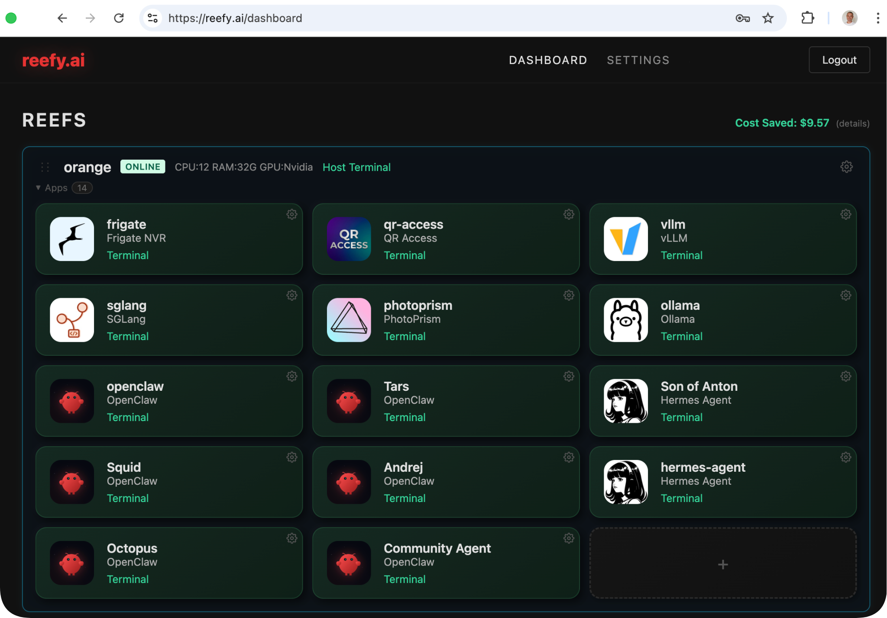
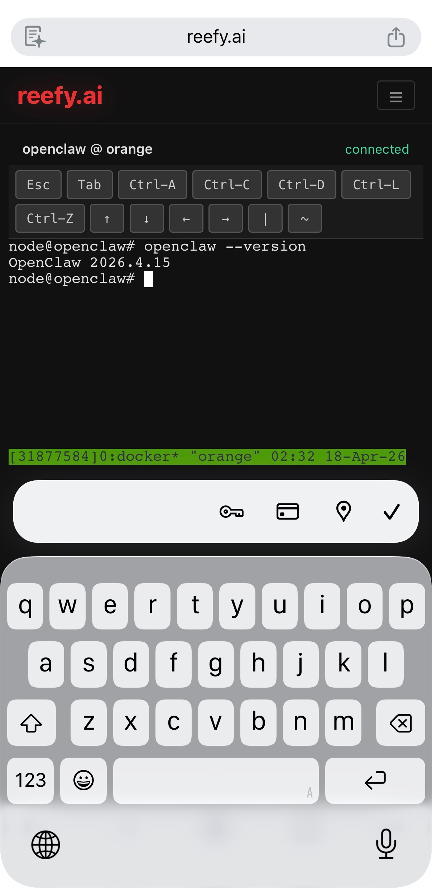
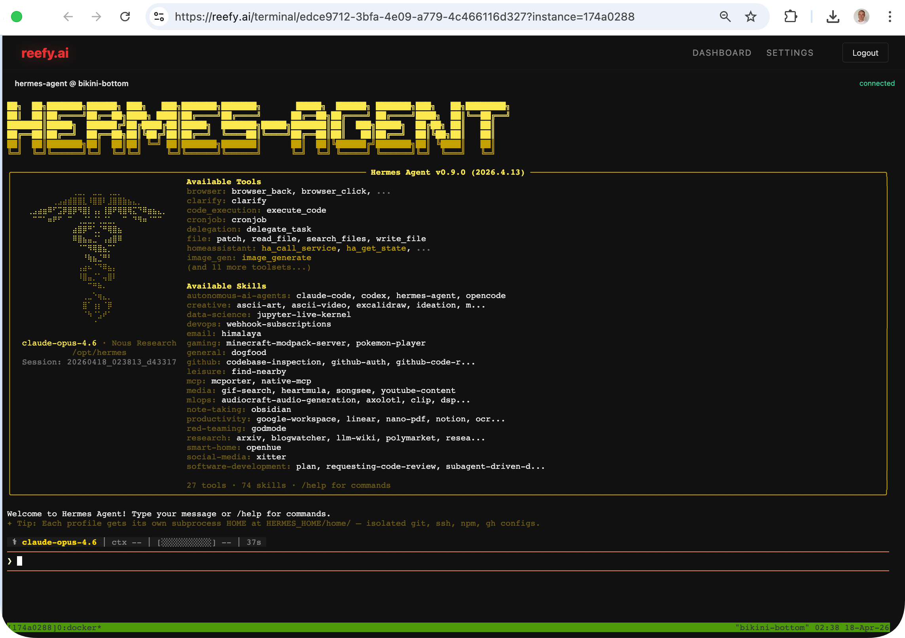
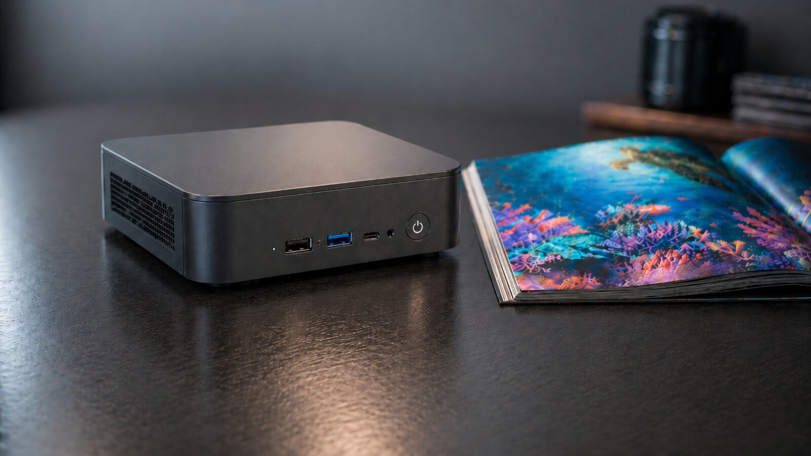
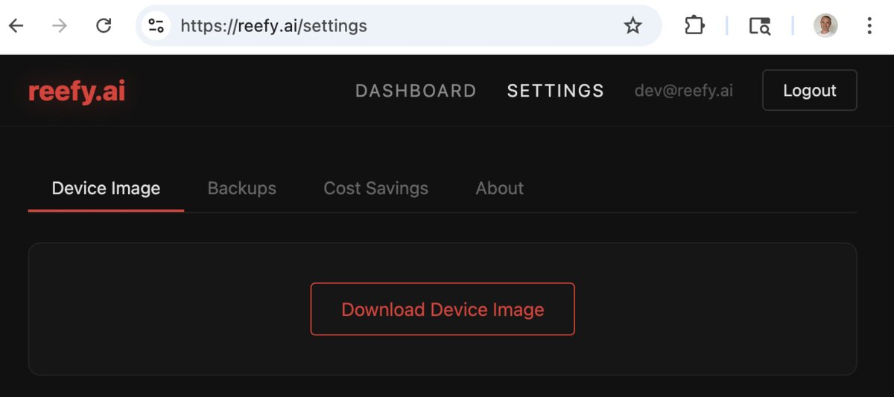
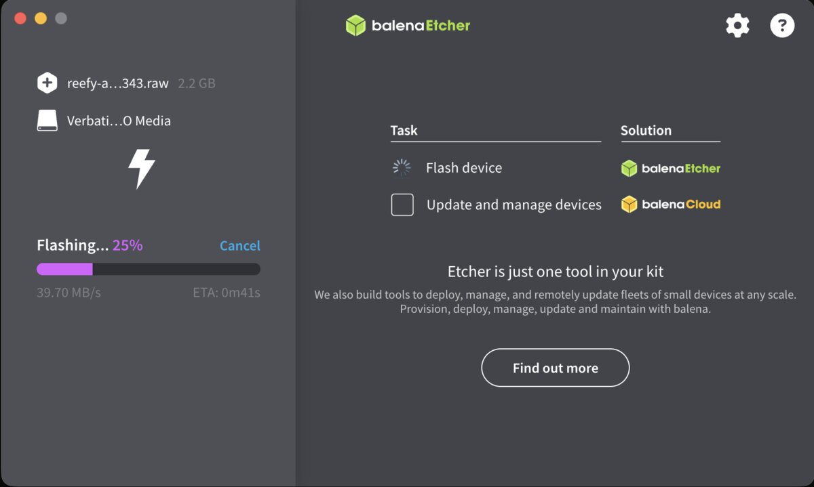

<p align="center">
  
  <h1 align="center">Turn your PC into a Reef</h1>
  <p align="center">
    <b>Cloud-like experience on your own hardware. No monthly bills.</b>
  </p>
</p>

<p align="center">
  
</p>

---

## Why Reefy?

**Why rent a cloud VPS for $10/month when the old PC under your desk can do more - for free?**

A $39 Intel NUC from eBay - 2-core Celeron, 8GB RAM, 128GB SSD - can run dozens of AI agents. The hardware you already own is more powerful than most people realize. You just need the right software to unlock it.

**Why send your private data to someone else's computer?** Your conversations with AI, your camera feeds, your documents - they don't need to live on a server you don't control.

**Reefy gives your own PC a cloud-like experience** - automated updates, encrypted backups, remote access, one-click app installs - without the cloud. This is what drove people to the cloud in the first place: convenience, not capability. Reefy brings that convenience home.

We're not replacing the cloud - we love clouds and Reefy uses them a lot under the hood! We're moving your personal work closer to you.

## Reimagined OS, built bottom-up for the AI era

Reefy OS isn't another shell on top of Ubuntu or Debian with a web UI bolted on. We started from Buildroot and hand-picked every package from the kernel up: 15-second cold boot, Nvidia GPU as a first-class citizen, immutable A/B root with auto-rollback, encryption keyed to a USB dongle, and no package manager on the device so the system never drifts. The app catalog is AI-focused from day one - AI agents (OpenClaw, Hermes), local LLM inference (Ollama, vLLM, SGLang), vision pipelines - not retrofitted onto a general-purpose distro. Legacy distros weren't designed to boot fast, run GPU workloads natively, survive bad updates in remote closets, and keep your data on your side of the wire. Reefy OS was.

## Control your PC from anywhere

Secure tunnels to every device. No port forwarding, no VPN, no static IP needed.

<p align="center">
  
</p>

Built-in web terminal with on-screen control buttons gives you a full terminal experience even from your phone - manage your reefs on the go.

<p align="center">
  
</p>

Reefy gives every running app (Docker container) its own terminal, so you don't have to manually `docker exec` into your agent - just click and you're inside. All sessions run inside `tmux`, so your work is preserved: close the browser, switch devices, come back later, and pick up exactly where you left off.

## Key Features

**Zero-touch setup** - Flash a USB, boot any x86 machine, see it on your [dashboard](https://reefy.ai) in 60 seconds.

**15-second boot** - We optimized the Linux kernel and early boot services to eliminate ugly waits. From power button to running apps - blazing fast.

**Can't brick it** - A/B firmware with hardware watchdog. Bad update? Device automatically rolls back to the previous working version. Critical for devices in closets, attics, and remote locations.

**Works offline** - LAN access to all your apps when internet goes down. Devices issue their own SSL certificates that you can import into your browser for a near-internet experience without real internet. Can run fully air-gapped - think internet on the Moon or Mars when people start building habitats there, or security-sensitive environments with intentionally disconnected networks.

**Nvidia GPU support** - Latest Nvidia drivers included out of the box. Any Reefy app can access the GPU - run LLMs, AI inference, video processing, or CUDA workloads without driver hassles.

**Bare metal performance** - Docker containers run directly on x86 hardware. No hypervisor overhead. Every watt and every megabyte goes to your workload - especially important on small, low-power PCs.

**Encrypted & portable** - Data encrypted on disk with keys on the USB dongle. Pull the USB and the device is a paperweight - safe to give away or sell. Plug the USB into a new PC, restore from backup, and you're back in minutes. Have a spare device? You can achieve 99.9% availability (the cloud gold standard - under 9 hours downtime per year) by switching your workloads to the spare in minutes.

**Automated backups** - Your apps and data are backed up automatically. Restore to any device with one click. Replace a broken machine without losing anything. Pin a backup with a tag and use it as a baseline to multiply your agents - configure your OpenClaw or Hermes Agent once, then clone it to new devices without repeating the initial setup.

**One-click app install** - Deploy apps from the catalog or develop your own Reefy apps based on Docker containers. Each app gets its own isolated environment, accessible from anywhere with a secure link.

## Get Started

### 1. Bring a PC
Old laptop, mini-PC, used NUC, or a high-end server with GPUs.

<p align="center"></p>

### 2. Sign in and download your Reefy image
Log in at [reefy.ai](https://reefy.ai) with your Google or GitHub account - one click, no signup forms. Then grab your personalized device image from Settings.

<p align="center"></p>

### 3. Flash to a USB stick
Use [Balena Etcher](https://etcher.balena.io/) - cross-platform, drag the `reefy.raw` file in, pick your USB, click flash.

<p align="center"></p>

<details><summary>Command-line (Linux/macOS, no GUI)</summary>

`sudo dd if=reefy.raw of=/dev/sdX bs=4M`

</details>

### 4. Boot the PC from USB
Plug in the USB, power on, hit `Esc` or `Del` to open the boot menu. Pick the USB. Reefy boots in ~15 seconds.

<details><summary>Optional: if boot is blocked</summary>

Disable Secure Boot in your BIOS. Common path: *Security → Secure Boot → Disabled*.

</details>

### 5. Adopt the device
Your device shows up automatically in the [Reefy dashboard](https://reefy.ai) once it's online. Click **Adopt**, give it a name. Done.

<p align="center"><video src="images/step5-adopt.mp4" autoplay muted loop playsinline width="600"></video></p>

## Apps

Install apps from the built-in catalog with one click. Full catalog available once you adopt your first device.

| App | Description |
|-----|-------------|
| [OpenClaw](https://github.com/openclaw/openclaw) | Personal AI assistant gateway |
| [Hermes Agent](https://github.com/nousresearch/hermes-agent) | Autonomous AI agent |
| [Ollama](https://ollama.ai) | Run LLMs locally (Nvidia GPU accelerated) |
| [vLLM](https://github.com/vllm-project/vllm) | High-performance LLM inference (Nvidia GPU accelerated) |
| [SGLang](https://github.com/sgl-project/sglang) | High-throughput LLM serving (Nvidia GPU accelerated) |
| [Frigate](https://frigate.video) | Real-time camera NVR with object detection |
| [PhotoPrism](https://photoprism.app) | Self-hosted photo management |
| Dev Ubuntu | Full Ubuntu development environment |
| Dev Fedora | Full Fedora development environment |
| Guppy | Lightweight test app for developers |

Reefy apps are regular Docker containers under the hood - bring your own image or wrap any existing one as a Reefy app.

## How It Works

```
   Your PC + Reefy OS              reefy.ai
  ┌───────────────────┐         ┌──────────────┐
  │  Apps (Docker)    │ ──────▶ │  Dashboard   │
  │  Reefy OS         │ tunnel  │  Fleet mgmt  │
  └───────────────────┘         └──────────────┘
```

Reefy OS is a minimal, immutable Linux distribution. It runs entirely from a USB drive - your internal disk is used only for encrypted app data. Updates are atomic A/B swaps with automatic rollback. The device opens a secure outbound tunnel to reefy.ai - no port forwarding, no VPN.

---

<p align="center">
  <b>Ready to turn your PC into a Reef?</b><br>
  <a href="https://reefy.ai">Get started at reefy.ai →</a>
</p>
